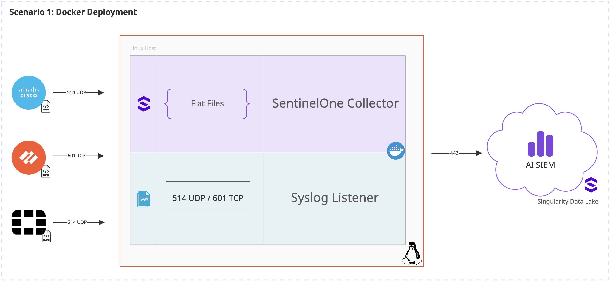

# Install the SentinelOne Collector on Docker with Syslog

> Quick-Start Guide for a Single Source  
> (Note: Support for multiple sources on the same port can be found here: https://github.com/sva-s1/syslog-collector)



> [!IMPORTANT]
> This project provides a straightforward way for practitioners to set up the SentinelOne Collector to ingest syslog events into AI SIEM using Docker. You don't need to be a Linux or Docker expert to follow along!

_Please `star` this page if you find it helpful._

**Official SentinelOne Documentation:**

- Install the SentinelOne Collector on Docker with JSON: [https://community.sentinelone.com/s/article/000006796](https://community.sentinelone.com/s/article/000006796)
- SentinelOne Collector for Syslog: [https://community.sentinelone.com/s/article/000008665](https://community.sentinelone.com/s/article/000008665)

## Use Cases

- **Most common use-case, covered in this project:** Streaming Syslog events from various sources (like firewalls, routers, and servers) directly to AI SIEM.
- **Less common, not covered here:** Collecting Docker container logs using the Docker Plugin.
- **Not covered here:** Host flat file collection.
- **Other SentinelOne Collector Plugins:** [https://community.sentinelone.com/s/topic/0TO69000000as6XGAQ/sentinelone-collector-plugins](https://community.sentinelone.com/s/topic/0TO69000000as6XGAQ/sentinelone-collector-plugins)

Please refer to the official documentation for detailed system requirements.

The source code for each plugin is available on Github: [https://github.com/scalyr/scalyr-agent-2/tree/master/scalyr_agent/builtin_monitors](https://github.com/scalyr/scalyr-agent-2/tree/master/scalyr_agent/builtin_monitors)

## Why use this project?

This project simplifies the process of setting up a SentinelOne Collector for syslog ingestion into AI SIEM. It provides pre-configured example files and step-by-step instructions tailored for those who are new to Docker and Linux environments. By using Docker, we ensure a consistent and isolated environment for the collector, making installation and management much easier.

## How to Stream Syslog Events to AI SIEM/SDL

The Syslog Collector allows you to ingest syslog events into your SentinelOne Singularity™ Data Lake (SDL) for analysis and monitoring. This collector is built using the SentinelOne Collector, syslog-ng (a robust logging system), and Docker Compose for easy deployment.

**Important Note:** Currently, only Linux hosts are fully supported for the `host` networking driver used by this setup.

The SentinelOne Collector uses the `addEvents` API ([https://community.sentinelone.com/s/article/000006773](https://community.sentinelone.com/s/article/000006773)) to upload messages efficiently.

### Prerequisites

You'll need the following installed on the host where you plan to run the collector:

1.  **Docker:** This is a platform that allows you to run applications in isolated environments called containers.

    - **Installation Steps (Linux/Ubuntu):**
      - It's generally recommended **not** to install Docker from your distribution's default repositories as they might be outdated.
      - Follow the official Docker Engine installation guide for Ubuntu: [https://docs.docker.com/engine/install/ubuntu/](https://docs.docker.com/engine/install/ubuntu/)
    - **Installation Steps (Mac):**
      - Follow the official Docker Desktop for Mac installation guide: [https://docs.docker.com/desktop/install/mac-install/](https://docs.docker.com/desktop/install/mac-install/)
    - For detailed instructions and other operating systems, always refer to the official Docker Documentation: [https://docs.docker.com/engine/install/](https://docs.docker.com/engine/install/)

2.  **Docker Compose:** This tool helps you define and run multi-container Docker applications. It comes bundled with Docker Desktop for Mac. For Linux, you might need to install it separately.

    - **Installation Steps (Linux/Ubuntu):**
      - Follow the official Docker Compose installation guide: [https://docs.docker.com/compose/install/](https://docs.docker.com/compose/install/)

3.  **AI SIEM Log Access Write Key (or API token with SDL write permissions):** This key allows the collector to send data to your AI SIEM instance.

    - **How to Generate the Key:**
      1.  At the top left of the SentinelOne Console, click the arrow to open the **Scopes** panel and select the appropriate scope (this is crucial as it determines where your data will be ingested).
      2.  In Singularity Data Lake, open the menu next to your user name and select **API Keys**.
      3.  Copy the write key value from the **Log Access Keys** section, or create a new one if needed.
      - For more details, see: [https://community.sentinelone.com/s/article/000006763](https://community.sentinelone.com/s/article/000006763)

4.  **AI SIEM Ingest URL:** For example, `xdr.us1.sentinelone.net`. You'll need the correct URL for your specific Datacenter.
    - See Services and Ports for Management: [https://community.sentinelone.com/s/article/000004961](https://community.sentinelone.com/s/article/000004961)

## Docker Project Steps

Follow these steps to get your SentinelOne Collector (formerly AI SIEM agent) running with syslog ingestion via Docker.

### 1. Get the Project Code

First, you need to get the project files onto your machine.

You can either:

- **Download the ZIP file:** Go to the GitHub repository ([https://github.com/sva-s1/s1-collector-syslog](https://github.com/sva-s1/s1-collector-syslog)) and click the green "Code" button, then "Download ZIP". Unzip the file to a location on your computer.
- **Use Git Clone (if you have Git installed):**
  ```bash
  git clone https://github.com/sva-s1/s1-collector-syslog.git
  cd s1-collector-syslog
  ```
  If you don't have Git installed, you can download it from [https://git-scm.com/downloads](https://git-scm.com/downloads).

Once you have the project code, your folder structure will look like this:

```

.
├── example-agent.json
├── example-docker-compose.yml
└── README.md

```

### 2. Download the SentinelOne Collector Docker Image

The SentinelOne Collector runs inside a Docker container. You'll need to pull the official image from Docker Hub. Open your terminal or command prompt and run:

```bash
docker pull scalyr/scalyr-agent-docker-json
```

> [!TIP]
> The `:latest` tag usually points to the most recent stable version.

### 3\. Configure Your API Key and Server URL

The collector needs to know where to send the logs and with what credentials.

- **Rename `example.env`:** In your project folder, you'll see a file named `example.env`. Make a copy of it and rename the copy to `.env`.

  - **Linux/Ubuntu:**
    ```bash
    cp example.env .env
    ```
  - **Mac:**
    ```bash
    cp example.env .env
    ```

- **Edit `.env`:** Open the newly created `.env` file in a text editor (like Notepad on Windows, TextEdit on Mac, or `nano`/`vim` on Linux).

  - Replace `TOKEN-GOES-HERE` with your actual **AI SIEM Log Access Write Token**.
  - Replace `REGION-INGEST-URL-HERE` with your **AI SIEM Ingest URL** (e.g., `https://xdr.us1.sentinelone.net`).
  
  ⚠️ **Important:** The URL must include the `https://` prefix for proper SSL/TLS connectivity.

  Your `.env` file should look something like this (with your actual values):

  ```ini
  AISIEM_LOGACCESS_WRITE_TOKEN=YOUR_ACTUAL_TOKEN_HERE
  AISIEM_SERVER=https://xdr.us1.sentinelone.net
  ```

### 4\. Create Your Project Folder and Copy Files

It's a good practice to organize your Docker project files.

- **For Linux (Ubuntu):**
  We suggest creating a dedicated directory for the collector configuration, for example, `/etc/s1collector`, as it's a common location for system configurations.

  ```bash
  sudo mkdir /etc/s1collector
  cd /etc/s1collector
  ```

  Now, copy the `agent.json` and `docker-compose.yml` files (which you'll create from the examples) into this directory.

- **For Mac:**
  You can simply work directly in the directory where you downloaded or cloned the project (e.g., `s1-collector-syslog`). The `.` (current directory) can serve as your "project folder".

  ```bash
  cd /path/to/your/s1-collector-syslog
  ```

### 5\. Prepare `agent.json` and `docker-compose.yml`

You have example files, but Docker Compose expects them without the `example-` prefix.

- **Rename `example-agent.json` to `agent.json`:**

  - **Linux/Ubuntu (if in `/etc/s1collector`):**
    ```bash
    sudo cp /path/to/your/downloaded/s1-collector-syslog/example-agent.json agent.json
    sudo nano agent.json # or vim, or your preferred editor
    ```
  - **Mac (if in project directory):**
    ```bash
    cp example-agent.json agent.json
    nano agent.json # or your preferred editor
    ```

- **Rename `example-docker-compose.yml` to `docker-compose.yml`:**

  - **Linux/Ubuntu (if in `/etc/s1collector`):**
    ```bash
    sudo cp /path/to/your/downloaded/s1-collector-syslog/example-docker-compose.yml docker-compose.yml
    sudo nano docker-compose.yml
    ```
  - **Mac (if in project directory):**
    ```bash
    cp example-docker-compose.yml docker-compose.yml
    nano docker-compose.yml
    ```

Your project folder (e.g., `/etc/s1collector` or your cloned directory) should now look like this:

```
.
├── agent.json
├── docker-compose.yml
└── .env
└── README.md (you're reading this!)
```

### 6\. Configure `agent.json`

The `agent.json` file tells the SentinelOne Collector which logs to collect and how to parse them. The provided `example-agent.json` is configured for Palo Alto Networks firewalls.

- Open `agent.json` in a text editor.
- **`protocols`**: This defines the syslog ports. `tcp:601` for TCP syslog and `udp:514` for UDP syslog are common.
- **`message_log`**: This is the internal log file name within the collector.
- **`parser`**: This is very important\! It tells AI SIEM how to understand the format of your logs. The example uses `marketplace-paloaltonetworksfirewall-latest`.
  - **Adjust this to match your log source.** If you're sending logs from a different device (e.g., a Cisco ASA, Windows Event Logs via syslog, etc.), you'll need to change this to the appropriate parser for that log type.
  - You can find more about parsing and available parsers here: [https://community.sentinelone.com/s/topic/0TO69000000as2mGAA/parsing-and-processing-logs](https://community.sentinelone.com/s/topic/0TO69000000as2mGAA/parsing-and-processing-logs)

### 7\. Configure `docker-compose.yml` (Docker Socket Path)

The `docker-compose.yml` file defines how your Docker containers will run. You'll need to ensure the `volumes` section correctly points to your Docker socket.

The `volumes` section will have a line like:
`- /var/lib/docker/docker.sock`

You need to substitute `/var/lib/docker/docker.sock` with the _actual_ path to your Docker socket.

- **To Find Your Docker Socket Path:**

  - **Ubuntu Example:**
    Open a terminal and run:

    ```bash
    docker info | grep "Docker Root Dir"
    ```

    You might see output like: `Docker Root Dir: /run/docker/sock`. In this case, your full Docker socket path would be `/run/docker/sock`.

  - **Mac Example:**
    Open a terminal and run:

    ```bash
    docker info | grep "Docker Root Dir"
    ```

    You might see output like: `Docker Root Dir: /var/lib/docker`. In this case, your full Docker socket path would be `/var/lib/docker/run/docker.sock`. (Note the additional `/run/docker.sock` for Mac).

- **Edit `docker-compose.yml`:**
  Open `docker-compose.yml` in a text editor and update the `volumes` section with your correct Docker socket path.

  Example `docker-compose.yml` snippet after editing (using an Ubuntu example path):

  ```yaml
  volumes:
    - .:/etc/scalyr-agent-2
    - /run/docker/sock:/var/run/docker.sock # <--- Make sure this path is correct for your system
  ```

  The `. : /etc/scalyr-agent-2` part maps your current project directory (where `agent.json` and `.env` are) into the container, so the collector can find its configuration.

### 8\. Start Docker Compose

Once all your files (`.env`, `agent.json`, `docker-compose.yml`) are in place and correctly configured within your project folder, you're ready to start the collector\!

- **Navigate to your project folder:**

  - **Linux/Ubuntu:** `cd /etc/s1collector`
  - **Mac:** `cd /path/to/your/s1-collector-syslog`

- **Start in Foreground (for troubleshooting):**
  This command will start the Docker containers and print their logs directly to your terminal. This is very useful for seeing if there are any errors during startup.

  ```bash
  docker compose up
  ```

  If `docker compose up` doesn't work, try `docker-compose up` (some older Docker installations use the hyphenated version).
  To stop and exit, press `Ctrl + C`.

- **Start in Detached Mode (once working):**
  Once you're sure everything is working correctly, you can run the containers in the background, so they don't tie up your terminal.

  ```bash
  docker compose up -d
  ```

### 9\. Check Running Containers

You can verify that your Docker containers are running.

- **Check Docker Compose Project Containers (must be in project folder):**
  ```bash
  docker compose ps
  ```
- **Check All Running Containers (anywhere on your system):**
  ```bash
  docker ps
  ```

### 10\. Test Syslog Ingestion

Now, let's send a test syslog message to your collector\!

- **Mac Example (requires `util-linux` via Homebrew):**
  If you don't have `util-linux` installed, you can get it with Homebrew:

  ```bash
  brew install util-linux
  ```

  Then, send test messages:

  ```bash
  /opt/homebrew/opt/util-linux/bin/logger --server localhost --port 514 --udp "Test message to syslog over UDP from Mac"
  /opt/homebrew/opt/util-linux/bin/logger --server localhost --port 601 --tcp "Test message to syslog over TCP from Mac"
  ```

- **Linux (Ubuntu) Example:**
  The `logger` command is usually installed by default on Ubuntu. If not, you can install it via:

  ```bash
  sudo apt update
  sudo apt install bsdutils
  ```

  Then, send test messages:

  ```bash
  logger -P 514 -n 127.0.0.1 -p user.info "Test message to syslog over UDP from Linux"
  logger -T 601 -n 127.0.0.1 -p user.info "Test message to syslog over TCP from Linux"
  ```

### 11\. Check AI SIEM Console for Events

Finally, log in to your AI SIEM console and verify that the test messages are being ingested.

- Go to **Event Search** \> **All Data**.
- In the search filter, try: `serverHost != 'scalyr-metalog' AND message contains 'Test message to syslog over UDP'` (adjust for TCP test messages as well).
- You should see your test messages appearing\! It might take a minute or two for them to show up.

**Tip:** Use the "soc view" on the "ALL event search" filter for a broader perspective if you're not seeing anything initially.

## Troubleshooting

If you're not seeing your logs in AI SIEM, here are some common troubleshooting steps:

1.  **Check Host Listening Ports:**

    - Ensure your host is actually listening on ports 514 (UDP) and 601 (TCP).
    - **Linux:**
      ```bash
      sudo ss -tuln | grep -E '514|601'
      # Or using netstat (if ss isn't available)
      # sudo netstat -tuln | grep -E '514|601'
      ```
    - **Mac:**
      ```bash
      sudo lsof -i :514 -i :601
      ```
    - You should see output indicating that a process (likely Docker's `com.docker.vpnkit` or similar) is listening on these ports.

2.  **Check Host DNS Resolution:**

    - Verify that your host can resolve the AI SIEM destination URL (e.g., `xdr.us1.sentinelone.net`) to an IP address.
    - **Linux/Mac:**
      ```bash
      ping xdr.us1.sentinelone.net
      nslookup xdr.us1.sentinelone.net
      ```

3.  **Check Host Connectivity to AI SIEM:**

    - Ensure your host can reach the AI SIEM ingest URL. This can be blocked by a host firewall or a network firewall.
    - Use `curl` to test connectivity to the AI SIEM server on the expected port (usually 443 for HTTPS).
    - **Example:**
      ```bash
      curl -v https://xdr.us1.sentinelone.net
      ```
      Look for a successful connection. If it hangs or shows errors, a firewall might be blocking it.

4.  **Host Firewall:**

    - If you suspect your host's firewall (e.g., `ufw` on Ubuntu, `pf` on Mac, or third-party firewalls) is blocking traffic, you can temporarily disable it for testing (requires elevated permissions).
    - **Ubuntu (UFW):**
      ```bash
      sudo ufw disable
      # If this fixes it, re-enable and add rules:
      # sudo ufw enable
      # sudo ufw allow 514/udp
      # sudo ufw allow 601/tcp
      ```
    - **Mac (pfctl):** `pf` is complex. It's usually easier to check macOS System Settings \> Network \> Firewall, or consult a network administrator.
    - **Always re-enable your firewall and add specific rules once you've identified the issue.**

5.  **Check Docker Container Logs:**

    - If you started with `docker compose up -d`, you can still view the logs of your running collector container:
      ```bash
      docker compose logs s1-collector
      ```
      Look for any error messages related to connectivity or configuration.

---

### Other Helpful Documentation

- Environment-Aware Variables for the SentinelOne Collector: [https://community.sentinelone.com/s/article/000006810](https://community.sentinelone.com/s/article/000006810)

### Example Files for Reference

These are the contents of the `example-` files provided in the repository, which you'll adapt for your setup:

**`example.env`:**

```ini
AISIEM_LOGACCESS_WRITE_TOKEN=TOKEN-GOES-HERE
AISIEM_SERVER=REGION-INGEST-URL-HERE

# Example USA region URL:
# [https://xdr.us1.sentinelone.net](https://xdr.us1.sentinelone.net)
```

**`example-docker-compose.yml`:**

```yaml
# Configuration for this S1 Collector Agent. For help:
# https://community.sentinelone.com/s/topic/0TO69000000as2qGAA/sentinelone-collector

services:
  s1-collector:
    image: scalyr/scalyr-agent-docker-json
    container_name: s1-collector
    restart: unless-stopped
    environment:
      - "SCALYR_API_KEY=${AISIEM_LOGACCESS_WRITE_TOKEN}"
      - "SCALYR_SERVER=${AISIEM_SERVER}"
    ports:
      - "514:514/udp"
      - "601:601/tcp"
    volumes:
      - .:/etc/scalyr-agent-2
      - /var/lib/docker/docker.sock # <-- **UPDATE THIS PATH!**

# Note: To find your Docker socket path on macOS, run:
# `docker info | grep "Docker Root Dir"` and append `/run/docker.sock` to the output.
# For example, if the output is `/var/lib/docker`, then the socket path would be `/var/lib/docker/run/docker.sock`.

# Note: To find your Docker socket path on Ubuntu, run:
# `docker info | grep "Docker Root Dir"` and append `/docker.sock` to the output.
# For example, if the output is `/run/docker/sock`, then the socket path would be `/run/docker/sock`.
```

**`example-agent.json`:**

```json
{
  "monitors": [
    {
      "module": "scalyr_agent.builtin_monitors.syslog_monitor",
      "protocols": "tcp:601, udp:514",
      "accept_remote_connections": true,
      "message_log": "palo.log",
      "parser": "marketplace-paloaltonetworksfirewall-latest"
    }
  ]
}
```
